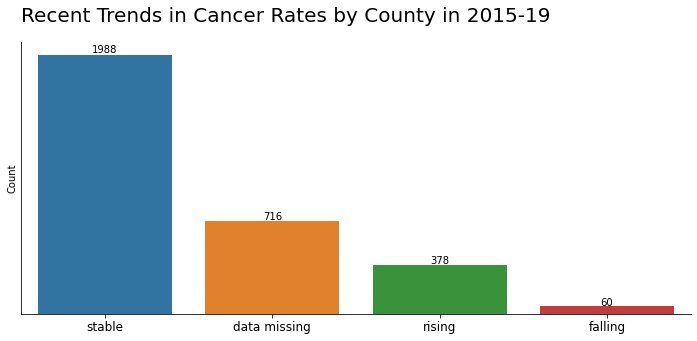
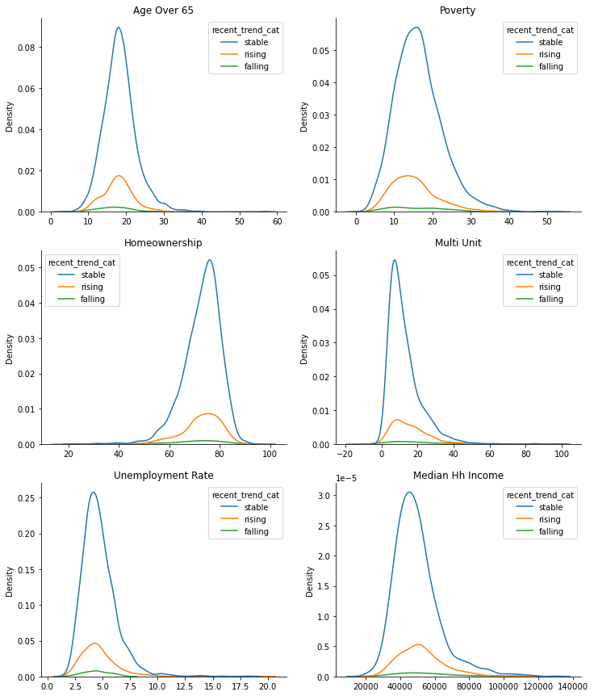
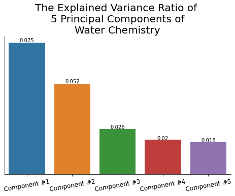
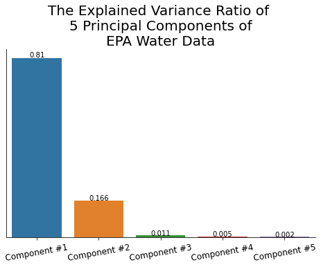
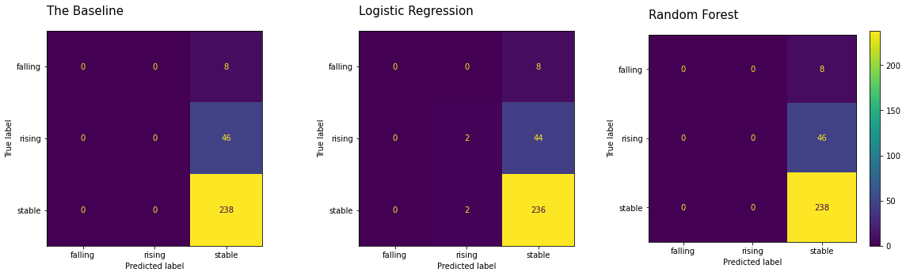
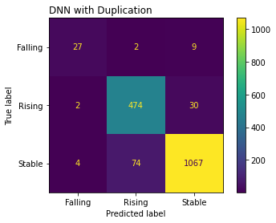

# Predicting Cancer using NIH and EPA datasets

by August VanHout, Manlai Amarsaikhan, and Michael Renehan

### Problem Statement

The Environmental Protection Agency makes many datasets available to the public based on records and reporting across industry and the environment. 

Given a variety of factors including demographic data, water quality, and industrial chemical reporting, is there a relationship to area cancer trends?

### Public Good

An effective model could potentially forecast trends in health using leading environmental indicators, potentially leading to more environmentally-friendly policies and improved health. 

## Data

### Data Collection

- Basic Information on US Counties was collected 
    - County data for the year 2019 was collected from openintro.org, a company which creates textbook datasets. The source of its data was U.S. Census Quickfacts. Each county was identified uniquely with a "FIPS" number, which is a five digit state-county identifier.
    - The data covered all 3,100+ counties in the United States, and included fields such population, median household income, home ownership, and in-place smoking bans.
    - Additional data was collected from the U.S. Census Bureau - the percentage of the population over the age of 65. This was merged onto the county statistics data by FIPS code.
    - A data dictionary can be found here: 
        - https://www.openintro.org/data/index.php?data=county

- County-level cancer rates were collected
    - Data on cancer rates per county was from the National Insitute of Health.
    - Features included incidents per 100k people, recent trend increases, and generalized "rising/falling" trend categorization, as well as confidence intervals.

- River habitat, organism populations, and chemical elements in rivers were collected
    - Environmental data pertaining to water was collected from the EPA and then merged together by FIPS code. Two datasets were collected for the 2013 and 2018 river surveys, respectively.
    - Aside from sample-site metadata, the datasets included habitat metrics (physical river information), water chemistry, and benthic macroinvertibrate (little shrimp/bug) counts.
    - data dictionaries can be found on this path within the repo: 
        - [project_workflow / data/raw / epa/2017-2018 / data_dictionary](./project_workflow/data/raw/epa/2017-2018/data_dictionary/)

- A Chemical Data Report (CDR) dataset was collected from the EPA
    - Every four years, companies report potentially harmful chemicals currently in large-scale use. One such report for 2020 was collected.
    - The data contains the names of chemicals in use within each zip code.

- All collected datasets were placed in this repository's [data/raw](./project_workflow/data/raw/) folder.

### Data Cleaning

- County Statistics
    - Two datasets were used. The first originated from the US Census bureau, and the second originated from openintro.org, ultimately also sourced from the US Census bureau.
    - The first dataset was trimmed to only contain FIPS code and `age_over_65` columns.
    - The two datasets were merged by FIPS code. Ultimately, before modeling, additional columns were trimmed, including `state`, `pop2000`, and `pop2010` (as only `pop2017` would be used.)
    - Further cleaning was performed after a merge with the Cancer dataset
        - Datatypes for the county statistics were corrected, and ordinal variables were imputed with numeric representations (i.e. `median_education` on a scale from 0 - 1, high school to bachelors)

- River Data
    - River data from years 2013 and 2018 followed identical intra-year exploration and merging processes.
        - Each dataset's columns and rows were investigated, as well as intersections of shared column names across sheets. 
        - The merging process entailed selecting relevant testing site profile columns and then merging habitat, water chemistry, and benthic macroinvertibrate data. This merge was performed with the sites `UID`.
    - The two years of data were concatenated.
        - The datasets for both 2013 and 2018 were trimmed to columns which interstected with one another, and then concatenated.
    - The full river dataset was then grouped by FIPS code and aggregated.
        - For numeric columns, the mean was taken. For categorical columns, the mode.

- Cancer Statistics
    - The original dataset from https://statecancerprofiles.cancer.gov/ covered trends by county from the years 2015 - 2019. The data was cleaned and processed to join it to other datasets from the EPA.
    - This cancer dataset was then merged onto the county statistics dataset, and then used in further eda and modeling.
        - The cancer data was ultimately reduced to `incidence_rate_per_100k`, `recent_trend_cat`, and `5yr_trend`

- Chemical Data Reporting Dataset
    - Using a crosswalk dataset of zip-code to fips-code found at  https://www.kaggle.com/datasets/danofer/zipcodes-county-fips-crosswalk, the EPA's CDR dataset was grouped by fips code, counting unique reporting companies and chemicals within each fips.
    - Chemicals were spread into columns, and their presence in a county was dummified.
    - This dataset was merged onto the county statistics dataset by ZIP/FIPS, dropping counties without CDR data.

- Merging into [full_county_dataset.csv](./project_workflow/data/processed/full_county_dataset.csv)
    - County statistics, cancer presence, CDR chemicals, and river data were merged together by FIPS code.

### Exploratory Data Analysis

- The recent trend in cancer data was missing for 716 counties.

- The counties where cancer trend data is missing were dropped.

- The target variable is heavily imbalanced.

- The relationship between `recent_trend_cat` and some of the demographic data were explored using a kernel distribution estimation plot.

- The plots showed that the distribution of the variables are very consistent across different values of `recent_trend_cat`

- The other variables collected as explanatory variables - river habitat, organism populations, and chemical elements in rivers - were categorical variables (albeit with many unique values).

- After dummifying these columns, the dataset became a dataframe with 2426 rows and 6803 columns.

- Water chemistry and EPA water dataset had _too many_ columns, so a Principal Component Analysis was conducted to explore if these values could be narrowed down to few components.

- EPA water data was possible to be condensed into 2-3 principal components.

- It was not so easy for water chemistry. Even the first principal component only accounted for 0.075 of the explained variance.

## First Models

As a first pass, four models were trained to see whether river habitat or chemical elements in rivers affected recent trend in cancer rate.

There simply were no data on cancer rate status for some counties so these were dropped. The aim was to predict the recent trend in cancer which had three unique values: `stable`, `rising` and `falling`.

### Predicting Cancer using River Dataset

- The baseline accuracy was 0.815.

- A Logistic Regression with L2 penalty (`C=0.01`) was trained. The train accuracy was 0.824 and test accuracy was 0.815 for this model.

- A Random Forest Classifier of depth 1 and `n_estimators=300` was trained. The train accuracy was 0.816 and test accuracy was 0.815 for this model. 

The confusion matrices can be found below:

These models did not perform well at all. In fact, they did exactly the same as the baseline model.

### Predicting Cancer using Water Chemistry Dataset

Another pair of models were trained to see if water chemistry dataset can be used to predict recent trend in cancer rates. As before, the possible outcomes were `rising`, `falling` and `stable`.

- The baseline accuracy was 0.796.

- A Logistic Regression with L1 penalty (`C=0.01`) was trained. The train accuracy = 0.797 and test accuracy  = 0.797 was for this model.

- A Random Forest Classifier of depth 1 and `n_estimators=300` was trained. The train accuracy was 0.798 and test accuracy was 0.797 for this model. 

The confusion matrices can be found below:

## Chemical Data Reporting Models

- 2012 Reporting
- 30,000 Individual Chemical Reports
- Merged with NIH Cancer Data by county and, later, county demographic data

### CDR's and Random Forest Classifier

This approach was almost perfectly equivalent to the baseline, so it did not represent a great model.

Baseline: 78.2%, Validation Accuracy: 78.2%

One county, Harris County, TX, had vastly more reports than anywhere else, and it’s cancer incidence was stable, so we removed this county to see if our predictions were more accurate. They weren’t. 
The baseline here shifted because a large number of the stable class were removed. 

Baseline Model: 76.7%, Validation Accuracy: 76.7%

### CDR's and DNN

After several modeling attempts wherein rows were individual reports (counties have many reports), the data was reshaped to have each row represent a single county and each reported chemical as a binary feature, along with demographic data for each county.

Here again, the model was not substantially better than the baseline. This model also only predicted seven counties as having rising rates, out of 253. 

Baseline Model: 79.7%, Validation Accuracy: 79.9%

Since the imbalanced classes seemed to be the source of much of our difficulty, we duplicated the ‘rising’ data. This lowered the baseline (counties where cancer is not on the rise) and lifted our test accuracy slightly. 

Interesting, duplicating the ‘rising’ rows also led the model to make predictions in the even-smaller ‘falling’ class, which the previous model did not. 

Baseline Model: 67.7%, Validation Accuracy: 80.7%

## Conclusion

Improving on baseline at predicting a rare class proved difficult despite trying a number of approaches and a variety of data points. With only a few thousand counties (depending on the availability of other data) it may not be enough to train an effective model with this type of complex data. 

Looking at historical data and trends over time would be one approach, and that is supported by the improved performance in the model with duplication. 

Additional analysis of which features are actually important might also be a good next step. 
